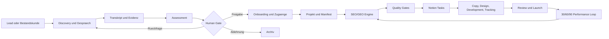

# Heartweb Operations Platform: End-to-End-Automatisierungsplan

> **UEBERHOLT:** Dieser Entwurf basiert auf einer falschen Architekturinterpretation. Er behandelt PostgreSQL als operative Source of Truth und OpenCode OMO als Bestandteil der Zielarchitektur. Verbindlich ist stattdessen der korrigierte Plan `2026-08-18_085500-heartweb-notion-n8n-ui-migrationsplan.md`: Notion ist das zentrale Steuerelement, n8n fuehrt den automatisierten Workflow aus, die eigene UI steuert den Prozess und ersetzt die lokale Claude Desktop App. OpenCode OMO wird ausschliesslich von Raphael und Hermes zur Entwicklung der UI verwendet.

**Praesentationsgrafik:** `.hermes/plans/heartweb-operations-platform-architecture.png`

**Desktop-Kopie fuer den Jesse-Call:** `C:\Users\offic\Desktop\Heartweb\heartweb-operations-platform-architecture.png`

## 1. Executive Summary

### Meine klare Einschaetzung

Ja: Der logische Zielzustand ist groesser als der aktuelle Claude-Desktop-SEO/GEO-Workflow. Das bestehende Framework ist der erste funktionsfaehige Domaenenmotor innerhalb eines kuenftigen Heartweb-Betriebssystems.

Der Zielprozess reicht vom ersten Kundengespraech ueber Potenzialpruefung, Assessment, Projektfreigabe, Onboarding und SEO/GEO-Planung bis zur operativen Aufgabenzuweisung in Notion, Produktion, Qualitaetssicherung, Veroeffentlichung und Performance-Rueckkopplung.

Die von Raphael vorgeschlagene Kombination ist grundsaetzlich richtig:

- Eine eigene Web-UI als Control Plane fuer Menschen
- n8n als Integrations- und Workflow-Orchestrator
- PostgreSQL als zentrale operative Datenquelle
- Notion als Arbeitsoberflaeche fuer Team und Task-Verteilung
- Das bestehende SEO/GEO-Framework als versionierter Fachdomaenenmotor
- OpenCode OMO als Entwicklungs-, Audit- und Refactoring-System, nicht als kritische Produktionslaufzeit
- Spezialisierte Agent-Worker fuer klar definierte, schema-validierte Produktionsaufgaben

### Die wichtigste Architekturentscheidung

Notion, n8n und OpenCode duerfen nicht gleichzeitig versuchen, die zentrale Wahrheit zu halten.

Empfohlene Rollenverteilung:

1. PostgreSQL ist die operative Source of Truth fuer Kunden, Assessments, Projekte, Status, Freigaben, Tasks und Workflow-Runs.
2. `manifest.json` bleibt die versionierte, portable Source of Truth eines konkreten SEO/GEO-Ausfuehrungslaufs.
3. Notion ist die kontrollierte Projektion fuer Zusammenarbeit und Statusbearbeitung.
4. n8n transportiert Events und fuehrt Integrationen aus, besitzt aber nicht den fachlichen Zustand.
5. OpenCode OMO baut, testet und wartet das System, verarbeitet aber keine Live-Kundenprozesse als unkontrollierter Agent.

### Was jetzt noch nicht getan werden sollte

Vor den Gespraechen mit Jesse, Max und Alexander sollte keine grosse Plattform gebaut werden. Zuerst muessen Prozess, Verantwortlichkeiten, bestehende Notion-Struktur, Tracking-Stack, Freigaberechte, Datenschutz und Hosting geklaert werden.

Die richtige naechste Investition ist ein vertikaler Pilot, nicht sofort ein vollstaendiges Multi-Tenant-SaaS.

## 2. Ausgangslage und Evidenz

### 2.1 Jesses Audionachricht vom 18. August 2026

Die lokal transkribierte Nachricht bestaetigt folgende Richtung:

- Jesse will Raphael das Sample-Briefing gebuendelt schicken.
- Am Mittwoch steht ein Gespraech mit Max und dessen Geschaeftspartner an.
- Am Freitag soll moeglicherweise ein Gespraech mit Alexander stattfinden.
- Weitere Prozesse sollen integriert werden.
- Sehr wahrscheinlich nennt Jesse automatisch erzeugte Tally-Formulare und PostHog fuer detailliertes Tracking.

Die Produktnamen Tally und PostHog sind wegen der Audioqualitaet noch als bestaetigungspflichtig zu markieren. Der Inhalt passt jedoch zu den bereits dokumentierten Meeting-Notizen.

### 2.2 Bereits dokumentiertes Zielbild

Die Meeting-Notiz vom 17. August beschreibt bereits:

- Eine spaetere zentrale Web-UI oder ein Dashboard
- Kundenanlage und Briefing-Aufnahme
- Automatische Berechnung von Content-Plaenen
- Automatische Task-Zuweisung
- Notion als operative Teamoberflaeche
- Max als moeglichen Partner fuer n8n-Automation
- Alexander als Verantwortlichen fuer Tracking

Quelle: `00_admin/meetings/2026-08-17-meeting-raphael-jesse.md`.

### 2.3 Aktueller technischer Reifegrad

Das bestehende Repository enthaelt bereits einen weit entwickelten SEO/GEO-Produktionsmotor:

- Neun versionierte Produktions-Prompts von Kickoff bis HTML-Landingpage
- Ein validierbares `manifest.json`-Datenmodell
- Zielmarkt- und AgentSEO-Vertraege
- Deterministische Solver- und Schema-Tools
- Fail-Fast-Regeln und Human-Review-Gates
- Notion-kompatible Content-Briefings
- Acceptance Tests und Fixtures
- GEO-Erweiterungen fuer Evidence Containers, Semantic Triples, Entity Graphs und AI-Search-Zitationen

Das Framework ist jedoch noch keine vollstaendige Agenturplattform. Es setzt erst nach dem Vorliegen eines relativ fertigen Kundenbriefings ein.

### 2.4 Aktueller Repository-Zustand

Der Branch ist `master` und folgt `origin/master`.

Lokal liegen noch nicht versionierte Weiterentwicklungen vor:

- `mcp/tools/capacity_matrix_solver.py`
- `mcp/tools/validate_schema_jsonld.py`
- `tests/run_acceptance_tests.py`
- `tests/fixtures/sample_briefing.md`
- `tests/fixtures/sample_landingpage.html`

Zusaetzlich ist `00_admin/PROJECT_STATE.md` veraltet. Es nennt noch v1.3.0 als Arbeitsstand, waehrend Changelog und Code bereits v1.4.0 dokumentieren. Diese Zustandsabweichung ist selbst ein Beispiel dafuer, warum die spaetere Plattform einen einzigen kontrollierten Betriebszustand braucht.

### 2.5 Aktueller OpenCode-OMO-Zustand

Der Container `opencode-omo` ist aktuell gesund und erreichbar:

- Ports: `1455` und `4096`
- Netzwerk: `mem0-selfhosted_default`
- Docker Socket ist schreibbar eingebunden
- `/home/frater418/projekte` ist als `/workspace` eingebunden
- Im Container sind aktuell nur `opencode-omo-integration` und `vita-caribe` sichtbar
- Das Heartweb-Repository ist aktuell nicht in den Container eingebunden

Das Setup eignet sich spaeter fuer isolierte Entwicklungs- und QA-Auftraege. Der schreibbare Docker Socket ist fuer eine Entwicklungsumgebung vertretbar, aber fuer eine Produktionslaufzeit mit Kundendaten ein zu grosses Privileg.

## 3. Analyse der zehn Kundenbriefings

### 3.1 Inventar

Analysiert wurden zehn Briefings aus:

`C:\Users\offic\Desktop\Heartweb\Kundenbriefings\`

1. AHD Hausbesuch
2. Ayurveda Shunyata Villa
3. CL Performance
4. Daniela Landgraf
5. Epargne Plurielle
6. Holistic Tantra
7. LS Wohntraum
8. MobilePhysiotherapie24
9. Pflegedienst Sauerlach
10. Shunyata Villas Bali

Die Dokumente umfassen 312 bis 908 Woerter. Der Median liegt bei 711 Woertern.

### 3.2 Strukturabdeckung

| Briefing-Bereich | Abdeckung |
|---|---:|
| Der Kunde | 10 von 10 |
| Geschaeftsziel | 10 von 10 |
| Wofuer wir stehen | 10 von 10 |
| Zielgruppe und Kundenavatar | 10 von 10 |
| Sprache und Tonalitaet | 10 von 10 |
| Was noch fehlt | 10 von 10 |
| Warum es uns gibt | 9 von 10 |
| Wettbewerber | 9 von 10, plus eine abweichende Ueberschrift |
| Content-Schwerpunkt und Leistungspriorisierung | 9 von 10 |
| Standorte | 8 von 10 |

Epargne Plurielle ist deutlich kuerzer und enthaelt weder einen Standortbereich noch einen eigenen Content-Schwerpunkt. Holistic Tantra hat keinen separaten Standortbereich. Das aktuelle Format ist daher inhaltlich brauchbar, aber nicht maschinell konsistent genug fuer einen automatischen Produktionsstart.

### 3.3 Wiederkehrende Zugriffsblocker

Alle zehn Briefings nennen fehlende operative Zugaenge:

- Google Search Console: 10 von 10
- Google Analytics: 10 von 10
- Hosting: 10 von 10
- Google Business Profile: 10 von 10, mit einer abweichenden Multi-Profil-Variante
- YouTube Studio: 1 von 10
- OTA-Extranets: 1 von 10
- Social-Media-Konten: 1 von 10

Das Feld `Was noch fehlt` darf spaeter kein Freitextblock bleiben. Es muss zu einem Access-Request-Workflow mit Besitzer, Status, Frist, Verifikationsmethode und Abhaengigkeiten werden.

### 3.4 Die Briefings zeigen mindestens sechs unterschiedliche Projekttypen

1. Lokale YMYL-Gesundheitsprojekte:
   - AHD Hausbesuch
   - Pflegedienst Sauerlach
   - MobilePhysiotherapie24
   - Ayurveda Shunyata Villa

2. Nationale technische B2B-Projekte:
   - CL Performance

3. Personal Brand und Speaking:
   - Daniela Landgraf

4. Finanz- und Versicherungs-YMYL:
   - Epargne Plurielle

5. Sensible Sexualitaets- und Bildungsangebote:
   - Holistic Tantra

6. Hospitality mit mehreren Kanaelen:
   - Shunyata Villas Bali

7. Regionaler technischer Beratungsservice mit begrenzter Kapazitaet:
   - LS Wohntraum

Ein statisches Einheitsformular reicht deshalb nicht. Benötigt wird ein gemeinsamer Kern mit bedingten Workstream-Modulen.

### 3.5 Inhaltliche Komplexitaet, die das aktuelle Manifest nicht sauber abbildet

Die Briefings enthalten:

- Lokale, nationale und internationale Zielmaerkte
- Mehrsprachige Ausbaustufen
- Mehrere physische Standorte und reine Zielregionen
- Recruiting als parallelen Workstream
- OTA-, Social-, Video-, Ads- und Digital-PR-Arbeit
- Unterschiedliche Wachstumsintensitaeten und Kapazitaetsgrenzen
- YMYL- und Datenschutzrisiken
- Mehrere Angebote mit unterschiedlichen Prioritaeten
- Relaunch- und Staging-Situationen
- Multi-Domain- und Satelliten-Strategien

Das heutige Manifest hat unter anderem folgende Grenzen:

- `country` erlaubt nur DE, AT und CH.
- Es gibt nur ein Land und eine Hauptsprache.
- Unternehmensstandort, primaerer Suchmarkt und Expansionsmarkt sind nicht getrennt.
- Es gibt kein strukturiertes Access-Management.
- Es gibt keine Conversion- oder Event-Definition.
- Es gibt keine Baseline-KPIs.
- Es gibt keine Rollen-, Freigabe- oder Aufgabenverteilung.
- Es gibt keine strukturierten Workstreams ausserhalb des SEO/GEO-Ablaufs.
- Es gibt keine Quellen- und Vertrauenskennzeichnung pro Briefing-Aussage.

Beispiele:

- Epargne Plurielle kann mit einem Luxemburger Zielmarkt nicht korrekt in das bestehende Country-Enum eingeordnet werden.
- Ayurveda Shunyata Villa trennt Resort-Standort Sri Lanka von den Zielmaerkten DE, AT und CH.
- Daniela Landgraf plant spaeter Dubai und englischsprachige Inhalte.
- Shunyata Villas Bali verbindet SEO mit OTAs, Social Media, Google Ads und Package-Entwicklung.
- MobilePhysiotherapie24 hat viele Standorte, Satelliten-Domains, Google-Business-Profile und Recruiting.

### 3.6 Empfohlenes Briefing-Datenmodell

Das erste Kundengespraech darf nicht direkt in `manifest.json` gepresst werden. Empfohlen sind vier getrennte Schichten:

#### Schicht A: Roh-Evidenz

- Audio oder Video
- Transkript
- Kundendokumente
- Website-Snapshots
- Formulareingaben
- E-Mails und Notizen
- Quelle, Zeitstempel, Autor und Hash

#### Schicht B: Discovery Dossier

- Kunde und Ansprechpartner
- Aktueller Zustand
- Geschaeftsmodell
- Angebot und Prioritaeten
- Zielgruppen
- Markt und Standorte
- Wachstumsziel
- Grenzen und Risiken
- Bestehender Tool-Stack
- Vorhandene Assets und Zugaenge
- Offene Fragen
- Quellenbeleg und Confidence pro Aussage

#### Schicht C: Opportunity Assessment

- Strategischer Fit
- SEO/GEO-Potenzial
- Wettbewerb und erwartbare Zeit bis zu Signalen
- Conversion-Oekonomie
- Lieferfaehigkeit des Kunden
- Tracking-Reife
- Content- und Compliance-Risiko
- Access Readiness
- Empfohlener Scope
- Entscheidung: ablehnen, weiter qualifizieren, Pilot oder Vollprojekt

Die finale Entscheidung bleibt bei Jesse und Raphael.

#### Schicht D: Execution Manifest

Erst nach Freigabe wird ein versioniertes Manifest fuer den konkreten SEO/GEO-Lauf erzeugt. Es enthaelt nur verifizierte, ausfuehrungsrelevante Daten.

## 4. Zielbild: Heartweb Operations Platform

### 4.1 Zweck

Die Plattform soll den vollstaendigen Agenturprozess als kontrollierte Zustandsmaschine abbilden:



### 4.2 Architekturprinzipien

1. Fail-Fast statt stiller Fallbacks
2. Human Approval an kommerziellen, strategischen und publizistischen Gates
3. Idempotente Workflows, damit ein Event keine doppelten Projekte oder Tasks erzeugt
4. Strukturierte Schemas statt unkontrollierter Freitextweitergabe
5. Versionierte Prompts, Datenvertraege und Artefakte
6. Vollstaendige Auditierbarkeit
7. Geringste notwendige Rechte pro Integration
8. Notion als Collaboration Layer, nicht als Datenbankkern
9. n8n als Orchestrator, nicht als Geschaeftslogik-Monolith
10. OpenCode als Engineering-System, nicht als Live-Agenturbackend

## 5. Empfohlene technische Architektur

### 5.1 Control Plane: Eigene Web-UI

Empfehlung: Next.js mit TypeScript.

Die UI zeigt fuer jeden berechtigten Nutzer nur die relevanten Funktionen:

- Jesse: Pipeline, Assessments, Freigaben, Projektstatus und Performance
- Raphael: Systemzustand, Runs, Fehler, Datenqualitaet, Integrationen und Architektur-Gates
- Max: Freigegebene n8n-Integrationen und Automationsstatus
- Alexander: Tracking-Readiness, Event-Plan, Installation und Verifikation
- Copywriter und Entwickler: Zunaechst weiterhin Notion, spaeter optional eingeschraenkte UI-Ansichten

Die UI darf nicht einfach die n8n-Oberflaeche einbetten. n8n dokumentiert, dass fuer OEM-Einbettung ein gesondertes kommerzielles Abkommen erforderlich ist. Als unsichtbares Backend ueber API und Webhooks kann n8n dagegen hinter einer eigenen UI betrieben werden.

Quelle: https://docs.n8n.io/deploy/host-n8n/deploy-as-an-oem-integration

### 5.2 Operations API

Empfehlung: FastAPI mit Python und Pydantic.

Begruendung:

- Die bestehenden Heartweb-Tools sind Python-basiert.
- JSON-Schema und Pydantic lassen sich sauber verbinden.
- AgentSEO-, Validator- und Solver-Aufrufe koennen gekapselt werden.
- Asynchrone Jobs koennen mit expliziten Job-IDs und Status-Endpunkten betrieben werden.

Die API besitzt die Geschaeftsregeln. n8n darf diese Regeln nur aufrufen, nicht duplizieren.

### 5.3 PostgreSQL als operative Source of Truth

Kernobjekte:

- `clients`
- `contacts`
- `opportunities`
- `evidence_items`
- `discovery_dossiers`
- `assessments`
- `projects`
- `workstreams`
- `stage_gates`
- `workflow_runs`
- `artifacts`
- `tasks`
- `assignments`
- `access_requests`
- `integration_connections`
- `tracking_plans`
- `performance_snapshots`
- `audit_events`
- `error_events`

Jedes Objekt benoetigt eine externe stabile ID, Erstellungs- und Aenderungszeit, Versionsnummer und Verantwortlichen.

### 5.4 n8n als Workflow-Orchestrator

n8n eignet sich fuer:

- Webhooks
- Tally-Eingang
- E-Mail- und Kalenderereignisse
- Notion-Synchronisation
- Benachrichtigungen
- zeitgesteuerte Performance-Abfragen
- Aufruf der Operations API
- Retry mit kontrollierter Fehlerbehandlung

n8n eignet sich nicht als Ort fuer:

- komplexe fachliche Bewertungslogik
- langfristige zentrale Kundendatenhaltung
- unversionierte Prompt-Sammlungen
- grosse binaere Artefakte
- autonome strategische Entscheidungen

Fuer den ersten Pilot reicht eine einzelne n8n-Instanz mit PostgreSQL. Queue Mode mit Redis und mehreren Workern wird erst bei nachgewiesenem Parallelitaetsbedarf aktiviert. n8n empfiehlt Queue Mode als skalierbares Modell mit Main Instance, Redis und Workern.

Quelle: https://docs.n8n.io/deploy/host-n8n/configure-n8n/scaling/enable-queue-mode

### 5.5 Artifact Store

MVP:

- Versionierte Projektartefakte auf einem kontrollierten Dateisystem
- Datenbank speichert IDs, Pfade, Hashes und Metadaten

Spaeter:

- S3-kompatibler Object Store
- Verschluesselung
- Retention Policies
- unveraenderbare Versionen fuer Audits

### 5.6 SEO/GEO Engine Adapter

Das bestehende Repository bleibt fachlich eigenstaendig. Die neue Plattform ruft es ueber einen klaren Adapter auf:

- Framework-Version bestimmen
- Execution Manifest exportieren
- Schritt starten
- Job-ID zurueckgeben
- Artefakte registrieren
- Gate-Ergebnis schreiben
- Fehlercodes strukturiert weitergeben

Damit bleibt das aktuelle Framework nutzbar, testbar und unabhaengig von der spaeteren UI.

### 5.7 Notion Integration

Notion bleibt die operative Arbeitsflaeche fuer Aufgaben, Content-Briefings und Teamstatus.

Empfohlene Datenbanken:

1. Kunden
2. Projekte
3. Deliverables und Tasks
4. Content-Briefings
5. Freigaben
6. Tracking-Installationen
7. Issues und Blocker

Verbindliche Task-Properties:

- `external_task_id`
- Kunde
- Projekt
- Workstream
- Task-Typ
- Titel
- Status
- Prioritaet
- Verantwortlicher
- Reviewer
- Faelligkeitsdatum
- Abhaengigkeiten
- Quality Gate
- Acceptance Criteria
- Source Artifact URL
- Plattformstatus
- Notion Sync Status
- Version

Synchronisationsregel:

- Die Plattform erzeugt und versioniert Tasks.
- Notion darf definierte Status- und Bearbeiterfelder zurueckmelden.
- Freie Schema-Aenderungen in Notion duerfen den Kern nicht veraendern.
- Konflikte erzeugen einen sichtbaren Sync-Fehler statt einer stillen Ueberschreibung.

Die Notion API limitiert Verbindungen im Durchschnitt auf drei Requests pro Sekunde und hat Payload-Grenzen. Der Connector braucht zentrale Rate-Limit-Behandlung, Backoff, Jitter und Pagination.

Quelle: https://developers.notion.com/reference/request-limits

### 5.8 Tally Integration

Falls Jesse tatsaechlich Tally meint, ist es fuer den Intake geeignet:

- Bedingte Formulare je Projekttyp
- Automatische Folgefragen aus fehlenden Dossier-Feldern
- Signierte Webhooks an n8n oder die Operations API
- Sofortige 2xx-Bestaetigung und asynchrone Weiterverarbeitung

Tally dokumentiert signierte Webhooks, einen 10-Sekunden-Timeout und Retries. Die Verarbeitung muss deshalb den Eingang schnell bestaetigen und die eigentliche Arbeit asynchron ausfuehren.

Quelle: https://tally.so/help/webhooks

### 5.9 PostHog und Tracking

Falls Alexander PostHog nutzt, sollte zunaechst zwischen zwei Anwendungsfaellen unterschieden werden:

1. Produktanalyse der internen Heartweb-UI
2. Tracking auf Kundenwebsites

PostHog ersetzt nicht Google Search Console, Google Analytics, Google Business Profile oder SEO-Rank-Daten. Es ergaenzt diese Quellen um Events, Funnels, Pfade und gegebenenfalls Session Replay.

Fuer Gesundheits-, Finanz- und Sexualitaetsprojekte gilt:

- Keine sensiblen Formulardaten als Event-Properties
- Texteingaben standardmaessig maskieren
- Session Replay standardmaessig deaktivieren, bis Datenschutz und Consent geprueft sind
- Pro Kunde getrennte Projekte und Zugriffsrechte
- Event Taxonomy vor Implementierung freigeben
- EU-Region und Auftragsverarbeitung klaeren

PostHog weist selbst darauf hin, dass Self-Hosting fuer die meisten Teams nicht die beste Betriebsform ist und die Cloud eine EU-Region anbietet. Die Entscheidung liegt nach dem Gespraech mit Alexander.

Quelle: https://posthog.com/docs/self-host

## 6. Rolle von OpenCode OMO

### 6.1 Empfohlene Verwendung

OpenCode OMO ist sinnvoll fuer:

- Repository-Scaffolding
- parallele Implementierung klar abgegrenzter Module
- Code Review
- Testgenerierung
- Schema- und Migrationspruefung
- Security Review
- n8n-Workflow-JSON-Pruefung
- Dokumentation
- Upgrade- und Refactoring-Sprints

### 6.2 Nicht empfohlene Verwendung

OpenCode OMO sollte nicht:

- die zentrale Kundendatenbank sein
- autonom Kundenprojekte freigeben
- direkten Produktionszugriff auf alle Credentials erhalten
- ungeprueft Notion-Tasks oder Kundenkommunikation erzeugen
- als dauerhafter Request Handler der UI laufen
- mit schreibbarem Docker Socket und Live-Kundengeheimnissen kombiniert werden

### 6.3 Spaetere Einbindung

Erst nach Architekturfreigabe wird das neue Repository gezielt in den Container gemountet. Empfohlen ist ein separates Repository, zum Beispiel:

`heartweb-operations-platform`

Das bestehende Repository bleibt:

`claude-desktop-seo-workflow-production`

Die Trennung verhindert, dass ein funktionierender SEO/GEO-Fachdomaenenmotor mit UI, Auth, Datenbank, n8n und Hosting vermischt wird.

## 7. End-to-End-Prozess

### Stage 1: Lead oder Bestandskundenbedarf

Input:

- Lead-Formular
- Bestandskundenanfrage
- internes Opportunity-Signal

Automation:

- Kunde und Opportunity anlegen
- Duplikate ueber Domain, E-Mail und Firma pruefen
- Discovery Owner setzen

Gate:

- Jesse bestaetigt, dass die Opportunity geprueft werden soll

### Stage 2: Pre-Qualification

Pruefkriterien passend zum Heartweb-Modell:

- SEO ist ein relevanter Akquisitionskanal
- Wettbewerb bietet realistische Chancen
- Ergebnisse koennen innerhalb des Geschaeftsmodells wirtschaftlich wirken
- Wachstumskapazitaet ist vorhanden
- Tracking und Attribution sind moeglich
- Kunde akzeptiert langfristige Zusammenarbeit

Output:

- `qualified`
- `needs_more_information`
- `not_a_fit`

### Stage 3: Discovery-Vorbereitung

Automation:

- Website und vorhandene Daten erfassen
- bedingtes Kundenformular erzeugen
- fehlende Informationen markieren
- Agenda fuer das Erstgespraech erstellen

### Stage 4: Kundengespraech und Evidenz

Automation:

- Aufnahme nur mit Einwilligung
- Transkription
- Sprecherzuordnung
- Rohquelle unveraendert speichern
- Aussagen mit Quellenreferenzen extrahieren

Human Gate:

- Raphael oder Jesse prueft kritische Fakten und falsche Transkriptionsstellen

### Stage 5: Discovery Dossier

Automation:

- Informationen in ein strukturiertes Dossier ueberfuehren
- Widersprueche sichtbar machen
- fehlende Pflichtfelder auflisten
- keine unbekannten Werte schaetzen

Output:

- verifiziertes Dossier
- dynamisches Folgeformular
- Liste blockierender Fragen

### Stage 6: Opportunity Assessment

Automation:

- Markt-, Wettbewerbs-, Content-, Tracking- und Delivery-Readiness bewerten
- Scope-Vorschlag erzeugen
- Risiken und Abhaengigkeiten dokumentieren

Human Gate:

- Jesse entscheidet kommerziellen Fit
- Raphael entscheidet technische und operative Machbarkeit

### Stage 7: Angebot und Projektfreigabe

Output:

- genehmigter Scope
- Workstreams
- Verantwortliche
- Abnahmekriterien
- Messplan
- Startbedingungen

Keine Projektinitialisierung ohne Freigabe.

### Stage 8: Onboarding und Access Readiness

Automation:

- Access Requests aus dem Dossier generieren
- Zustandsanzeige pro Zugang
- Erinnerungen
- technische Verifikation

Fail-Fast:

- Ein Schritt startet nur, wenn seine benoetigten Zugaenge verifiziert sind.

### Stage 9: Projekt- und Manifest-Initialisierung

Automation:

- Kunden-Workspace anlegen
- Execution Manifest erzeugen
- Schema validieren
- Framework-Version festschreiben
- Artefaktregister initialisieren

Human Gate:

- Raphael prueft Domain, Zielmaerkte, Wettbewerber, Entitaeten und Scope.

### Stage 10: SEO/GEO-Produktion

Der bestehende Ablauf wird als Engine eingebunden:

`0 -> 1 -> 1b -> 1c -> 2 -> 3 -> 3b -> 4a -> 4b`

Jeder Schritt erzeugt:

- Run-ID
- Input-Versionen
- Output-Artefakte
- Validierungsergebnis
- Fehlercode oder Gate-Status

### Stage 11: Task-Erzeugung und Notion-Projektion

Aus Roadmap und Briefings entstehen strukturierte Tasks fuer:

- Copywriting
- Lektorat
- Design
- Development
- Tracking
- Upload
- QA
- Freigabe

Tasks werden erst nach dem zugehoerigen Quality Gate freigegeben.

### Stage 12: Produktion, Review und Launch

Notion bleibt die Arbeitsoberflaeche. Die Plattform erfasst:

- Status
- Blocker
- Version
- Reviewer
- Abnahme
- Veroeffentlichungsnachweis

### Stage 13: Performance Loop

Zeitpunkte:

- Tag 30
- Tag 60
- Tag 90
- spaeter fortlaufend

Datenquellen:

- Search Console
- Analytics
- Google Business Profile
- AgentSEO oder Rank Tracker
- PostHog, falls freigegeben
- CRM oder Lead-Daten, falls verfuegbar

Output:

- Performance Snapshot
- Abweichungen
- priorisierte Folgeaufgaben
- aktualisierter Plan nach Human Gate

## 8. Empfohlene UI-Ansichten

### 8.1 Portfolio Dashboard

- alle Kunden
- Projektphase
- Blocker
- ueberfaellige Gates
- offene Access Requests
- Performance-Signale

### 8.2 Intake Inbox

- neue Leads
- neue Audios und Dokumente
- unvollstaendige Dossiers
- offene Folgefragen

### 8.3 Customer Dossier

- Firmenprofil
- Kontakte
- Angebote
- Zielgruppen
- Maerkte
- Evidenz
- Risiken
- offene Fragen

### 8.4 Assessment Workspace

- Bewertung je Kriterium
- Quellen
- AI-Vorschlag
- Jesse-Freigabe
- Raphael-Freigabe
- Scope-Entscheidung

### 8.5 Project Control

- Phasen
- Runs
- Artefakte
- Gates
- Fehler
- Framework-Version

### 8.6 Task Matrix

- Notion-Sync
- Owner
- Reviewer
- Abhaengigkeiten
- Quality Gates
- Faelligkeit

### 8.7 Tracking Readiness

- Event Taxonomy
- Consent
- GA4
- GSC
- GBP
- PostHog
- Verifikation

### 8.8 Error Center

- Fehlercode
- betroffener Kunde
- Workflow
- Input-Version
- Retry-Status
- Verantwortlicher
- Remediation

## 9. Geplante n8n-Workflows

| ID | Workflow | Trigger | Ergebnis |
|---|---|---|---|
| WF-01 | Lead Intake | Formular oder API | Opportunity angelegt |
| WF-02 | Discovery Package | Opportunity freigegeben | Agenda und Kundenformular |
| WF-03 | Conversation Ingest | Audio oder Transkript | Evidenz und Transkript |
| WF-04 | Dossier Normalization | Evidenz vollstaendig | Strukturiertes Dossier |
| WF-05 | Assessment Draft | Dossier validiert | Assessment zur Freigabe |
| WF-06 | Approval Routing | Assessment bereit | Jesse- und Raphael-Gate |
| WF-07 | Access Requests | Projekt freigegeben | Zugriffsaufgaben und Erinnerungen |
| WF-08 | Project Bootstrap | Access Gate bestanden | Projekt und Manifest |
| WF-09 | SEO/GEO Run | Schritt freigegeben | Job-ID und Artefakte |
| WF-10 | Notion Projection | Task-Paket freigegeben | Notion-Seiten und Tasks |
| WF-11 | Tracking Setup | Tracking-Auftrag | Installations- und QA-Tasks |
| WF-12 | Performance Cycle | Zeitplan | Snapshot und Folgeplan |
| WF-99 | Error and Dead Letter | Fehler | sichtbarer Incident |

Jeder Workflow braucht:

- Correlation ID
- Idempotency Key
- Version
- strukturierte Eingabe und Ausgabe
- expliziten Timeout
- begrenzte Retries
- Dead-Letter-Pfad
- Alerting
- Audit Event

## 10. Empfohlene Repository-Struktur fuer die spaetere Plattform

Diese Struktur ist ein Vorschlag fuer eine neue, getrennte Codebasis. Sie wird in diesem Plan nicht angelegt.

```text
heartweb-operations-platform/
  apps/
    control-plane/
  services/
    operations-api/
    agent-worker/
    integration-worker/
  packages/
    contracts/
    domain-model/
    seo-geo-engine-adapter/
    notion-client/
    tracking-contracts/
  workflows/
    n8n/
      lead-intake/
      discovery/
      assessment/
      onboarding/
      seo-geo/
      notion-sync/
      tracking/
      performance/
      errors/
  infra/
    docker/
    migrations/
    monitoring/
  tests/
    contract/
    integration/
    end-to-end/
    fixtures/
  docs/
    architecture/
    adr/
    runbooks/
    data-protection/
```

Wichtige kuenftige Vertraege:

- `packages/contracts/client-intake.schema.json`
- `packages/contracts/discovery-dossier.schema.json`
- `packages/contracts/opportunity-assessment.schema.json`
- `packages/contracts/access-request.schema.json`
- `packages/contracts/project-charter.schema.json`
- `packages/contracts/task.schema.json`
- `packages/contracts/tracking-plan.schema.json`
- `packages/contracts/workflow-event.schema.json`

## 11. Phasenplan

### Phase 0: Discovery und Verantwortlichkeiten

Ziel:

- Prozess vor Technik klaeren

Aktivitaeten:

- Jesses Zielbild bestaetigen
- Sample-Briefings gemeinsam bewerten
- Max' bestehende n8n-Kompetenz und Scope klaeren
- Alexanders Tracking-Stack klaeren
- Notion-Datenbanken und aktuelle Arbeitsweise aufnehmen
- Daten- und Freigabeverantwortung festlegen
- Datenschutz und Hosting klaeren

Gate 0:

- Ein genehmigtes Prozessdiagramm
- benannte Rollen
- definierter Pilot
- keine offenen Architekturblocker

### Phase 1: Domaenenmodell und Vertraege

Ziel:

- Daten vor Automatisierung stabilisieren

Deliverables:

- Discovery-Dossier-Schema
- Assessment-Schema
- Projekt- und Task-Schema
- Lifecycle State Machine
- Rollen- und Freigabematrix
- ADR fuer Source of Truth
- ADR fuer Notion-Synchronisation
- ADR fuer n8n-Grenzen
- Datenschutz- und Retention-Konzept

Gate 1:

- Alle zehn Briefings koennen entweder valide normalisiert werden oder brechen mit exakten fehlenden Feldern ab.

### Phase 2: Vertikaler Pilot

Empfohlener Happy-Path-Pilot:

- CL Performance, weil das Briefing relativ klar, nicht YMYL und auf einen nationalen B2B-Markt fokussiert ist

Empfohlener Negativtest:

- Epargne Plurielle, weil Pflichtbereiche fehlen und der Zielmarkt das heutige Manifest-Schema ueberschreitet

Empfohlener Komplexitaetstest:

- Shunyata Villas Bali oder MobilePhysiotherapie24, weil mehrere Kanaele, Regionen und Workstreams bestehen

Vertikaler Ablauf:

1. Briefing importieren
2. Dossier normalisieren
3. fehlende Felder sichtbar machen
4. Assessment erzeugen
5. Human Gate
6. Projekt und Manifest erzeugen
7. einen Engine-Schritt ausfuehren
8. ein Task-Paket in Notion anlegen
9. Status zuruecksynchronisieren
10. Audit Trail pruefen

Gate 2:

- Ein kompletter Durchlauf ohne manuelle Datenkopie und ohne stille Annahmen

### Phase 3: SEO/GEO-Engine voll anbinden

Ziel:

- Alle neun Schritte als kontrollierte Jobs ausfuehren

Deliverables:

- Engine Adapter
- Artefaktregister
- Run- und Gate-Status
- Error Mapping
- Versionsbindung
- E2E-Tests gegen reale Pilotdaten

### Phase 4: Eigene Control Plane

Ziel:

- Jesse und Raphael steuern den Prozess ohne n8n- oder Dateisystemkenntnisse

MVP-Screens:

- Portfolio
- Dossier
- Assessment
- Projektstatus
- Approval Queue
- Error Center

### Phase 5: Notion und Team-Distribution

Ziel:

- Task-Verteilung und Rueckmeldung stabilisieren

Deliverables:

- Notion-Datenmodell
- Mapping
- Rate-Limit-Handling
- Konfliktregeln
- Rollen-Templates
- Acceptance Checklists

### Phase 6: Tracking und Performance

Ziel:

- Nicht nur Content produzieren, sondern Wirkung messen

Deliverables:

- Event Taxonomy
- Consent- und Privacy-Regeln
- Tracking Installation Workflow
- GA4-, GSC-, GBP- und gegebenenfalls PostHog-Adapter
- 30/60/90 Performance Cycle

### Phase 7: Hardening und Skalierung

Ziel:

- Produktionsreife fuer mehrere parallele Kunden

Deliverables:

- Auth und RBAC
- Backups
- Monitoring
- Secret Management
- Queue Mode bei Bedarf
- Disaster Recovery
- Kostenkontrolle
- Runbooks
- Security Review

## 12. Bewertung des vorgeschlagenen Stacks

### Vorteile

| Entscheidung | Vorteil |
|---|---|
| Eigene UI | Klare Arbeitsoberflaeche ohne technische Toolkenntnisse |
| n8n | Schnelle Integration von Notion, Formularen, Mail, Kalender und Webhooks |
| PostgreSQL | Sauberer zentraler Zustand, Historie, Constraints und Reporting |
| Notion | Team arbeitet im bereits vertrauten System |
| Bestehende SEO/GEO Engine | Fachlogik muss nicht neu erfunden werden |
| OpenCode OMO | Beschleunigt Implementierung, QA und parallele Engineering-Sprints |
| Getrennte Repositories | Bestehender Motor bleibt stabil und unabhaengig deploybar |

### Nachteile und Gegenmassnahmen

| Risiko | Gegenmassnahme |
|---|---|
| n8n-Workflows werden unwartbar | Kleine Workflows, Versionierung, Contracts, keine Kernlogik in Nodes |
| Doppelte Wahrheit zwischen DB und Notion | PostgreSQL als Master, kontrollierte Feldsynchronisation |
| AI erfindet fehlende Briefingdaten | Quellenpflicht, Confidence, Fail-Fast und Human Gate |
| Scope waechst zu einem Agentur-ERP | Klarer MVP und ausdrueckliche Non-Goals |
| Tracking verletzt Datenschutz | Event Review, Maskierung, Consent und getrennte Kundenprojekte |
| OpenCode hat zu viele Rechte | Entwicklungs- und Produktionsumgebung trennen |
| Betrieb wird von einer Person abhaengig | Runbooks, Monitoring, klare Ownership und Supportmodell |
| Notion API wird gedrosselt | Queue, Backoff, Jitter, Pagination und Sync-Status |
| Mehrere Partner bauen parallel | Raphael besitzt Architektur und Contracts, Partner implementieren definierte Module |

## 13. Non-Goals des MVP

Der erste Pilot soll nicht:

- ein vollstaendiges CRM ersetzen
- ein externes Kundenportal bereitstellen
- n8n fuer Endnutzer einbetten
- Websites autonom publizieren
- kommerzielle Annahme oder Ablehnung autonom entscheiden
- alle Heartweb-Kanaele automatisieren
- freie autonome Agenten auf Kundendaten loslassen
- sofort Multi-Tenant-SaaS-Abrechnung und White Label bieten
- alle historischen Kunden migrieren

## 14. Raphaels Rolle

### Empfohlene Rollenbezeichnung

**Technical Operations & AI Integration Architect**

Fuer die groessere Plattform kann intern auch gelten:

**AI Operations Platform Lead**

### Tatsaechlicher Verantwortungsbereich

Raphael waere nicht nur derjenige, der einzelne Automationen klickt. Seine Rolle ist:

- Zielarchitektur
- Domaenenmodell und Datenvertraege
- Agenten- und Workflow-Governance
- Fail-Fast- und Quality-Gate-System
- technische Produktverantwortung
- Integration des SEO/GEO-Motors
- Abstimmung mit Max und Alexander
- OpenCode-Orchestrierung
- Security-, Observability- und Betriebsstandards
- technische Abnahme

### Empfohlene Stakeholder-Aufteilung

| Person oder Team | Rolle |
|---|---|
| Jesse | Business Sponsor, Kundenstrategie, kommerzielle Freigabe |
| Raphael | Architektur, technische Produktfuehrung, AI Operations und Quality Gates |
| Max und Partner | n8n- und Integrationsumsetzung innerhalb definierter Contracts |
| Alexander | Tracking-Architektur, Event Taxonomy und Verifikation |
| Copywriting-Team | Redaktionelle Produktion und fachliche Textqualitaet |
| Design und Development | technische und visuelle Umsetzung |
| Andreas | Administration und gegebenenfalls Onboarding-Koordination |

### Wichtige Rollengrenze

Raphael sollte nicht als unsichtbarer Allzweck-Techniker positioniert werden, der Architektur, Entwicklung, Support, Datenpflege und operative Fehlerbehebung ohne Entscheidungsrechte traegt.

Vor dem Build muessen geklaert werden:

- Entscheidungsbefugnis
- Scope Ownership
- laufender Support
- Priorisierung
- Budget oder Verguetungsmodell
- Hosting- und Betriebshaftung

## 15. Gespraechsleitfaden fuer Jesse

### Kernaussage

> Was wir jetzt gebaut haben, ist der SEO/GEO-Produktionsmotor. Der naechste logische Schritt ist eine Heartweb Operations Platform darum herum. Die Plattform nimmt den Prozess vom Erstgespraech bis zu Assessment, Freigabe, Projektanlage, Notion-Task-Verteilung und Performance-Loop auf. n8n orchestriert Integrationen, eine eigene UI steuert den Prozess, PostgreSQL haelt den Zustand und das bestehende Framework bleibt der spezialisierte SEO/GEO-Motor. OpenCode nutzen wir zum Bau und zur Qualitaetssicherung, nicht als unkontrolliertes Produktionsbackend.

### Entscheidungen, die Jesse treffen sollte

1. Welcher konkrete Prozessschritt verursacht heute am meisten Reibung?
2. Wer entscheidet, ob ein Kunde strategisch angenommen wird?
3. Welcher Teil des Assessments darf automatisiert vorgeschlagen werden?
4. Welche Notion-Datenbanken existieren bereits?
5. Wer besitzt den aktuellen n8n-Stack und die spaetere Wartung?
6. Sind die genannten Tools tatsaechlich Tally und PostHog?
7. Welche Daten darf Heartweb speichern und wie lange?
8. Welcher Kunde eignet sich fuer den Pilot?
9. Welche Personen muessen im MVP aktiv mit der UI arbeiten?
10. Welcher Erfolgsnachweis entscheidet ueber Phase 2?

### Fragen an Max

1. Welche n8n-Instanz und welches Hosting existieren bereits?
2. Welche Workflows sind bereits gebaut?
3. Wie werden Credentials, Versionierung, Backups und Fehler behandelt?
4. Wer wartet die Instanz?
5. Welche Notion-Objekte und IDs werden heute verwendet?
6. Wie werden Duplikate und Retries verhindert?
7. Soll Max implementieren oder auch Architekturentscheidungen treffen?
8. Welche Schnittstelle erwartet Max von Raphaels Plattform?
9. Welche Lizenz- und Hostingkosten bestehen?
10. Welche Teile koennen als exportierbares Workflow-JSON im Repository versioniert werden?

### Fragen an Alexander

1. Meint er tatsaechlich PostHog?
2. Geht es um Kundenwebsites, die interne UI oder beides?
3. Welche Events sind verbindlich?
4. Wie werden Leads und Umsatz zugeordnet?
5. Welche Consent-Management-Loesung wird verwendet?
6. Welche Daten duerfen nie erfasst werden?
7. Cloud EU oder Self-Hosted?
8. Wie werden GA4, GSC, GBP und CRM angebunden?
9. Wer verifiziert Installationen?
10. Welche Reports braucht Jesse fuer erfolgsbasierte Projekte?

## 16. Test- und Verifikationsplan

### 16.1 Contract Tests

- Jede Eingabe validiert gegen ein versioniertes Schema.
- Unbekannte Felder werden nach festgelegter Policy abgelehnt oder protokolliert.
- Fehlende Pflichtfelder erzeugen spezifische Fehlercodes.
- Keine Defaultwerte fuer Geschaeftsdaten ohne explizite Freigabe.

### 16.2 Golden Fixtures

Die zehn Briefings werden als Testkorpus genutzt:

- Happy Path
- unvollstaendiges Briefing
- Multi-Market
- Multi-Location
- YMYL
- Recruiting
- Multi-Channel
- Staging oder Relaunch

### 16.3 Workflow Tests

- doppelter Tally-Webhook erzeugt kein doppeltes Projekt
- n8n-Retry erzeugt keinen doppelten Notion-Task
- Notion 429 wird kontrolliert wiederholt
- Worker-Timeout erzeugt einen sichtbaren Fehler
- Human Gate blockiert Folgeaktionen
- fehlender Zugang blockiert nur den abhaengigen Schritt
- abgebrochener Run ist fortsetzbar

### 16.4 Security Tests

- Rollen sehen nur erlaubte Kunden
- Credentials erscheinen nicht in Logs
- Audio und Transkripte haben Retention Policies
- sensible Event-Properties werden abgelehnt
- Webhook-Signaturen werden verifiziert
- Docker-Produktionsworker haben keinen unnoetigen Docker-Socket

### 16.5 End-to-End-Abnahmekriterien

1. Eine Rohquelle wird unveraendert gespeichert und gehasht.
2. Das Dossier verweist pro kritischer Aussage auf eine Quelle.
3. Epargne Plurielle startet nicht still mit erfundenen Standort- oder Scope-Daten.
4. Ein internationaler Fall kann Standort und Zielmarkt getrennt speichern.
5. Kein Projekt startet ohne Human Gate.
6. Ein freigegebenes Briefing erzeugt nachvollziehbare Notion-Tasks.
7. Jede Task verweist auf ihr Quellartefakt und Acceptance Criteria.
8. Jeder Fehler ist im Error Center mit Remediation sichtbar.
9. Der bestehende SEO/GEO-Motor bleibt separat testbar.
10. Der Pilot kann auf den bisherigen manuellen Prozess zurueckfallen.

## 17. Rollback-Strategie

Die Plattform wird parallel zum bestehenden Prozess eingefuehrt.

- Notion bleibt waehrend des Piloten nutzbar.
- Der bestehende Claude-Desktop-Workflow bleibt funktionsfaehig.
- Automatische Task-Erzeugung ist per Feature Flag abschaltbar.
- Notion-Ruecksynchronisation ist separat abschaltbar.
- Datenbankmigrationen haben Down-Migrations oder getestete Restore-Pfade.
- n8n-Workflows werden versioniert exportiert.
- Jeder externe Schreibvorgang nutzt Idempotency Keys.
- Vor jedem Pilotlauf existiert ein Datenbank- und Workflow-Backup.

## 18. Offene Entscheidungen vor Implementierungsbeginn

### Blockierend

1. Tally und PostHog als korrekte Toolnamen bestaetigen
2. Pilotkunde festlegen
3. Notion-Schema und Berechtigungen aufnehmen
4. Max' Scope und bestehende n8n-Infrastruktur dokumentieren
5. Alexanders Tracking-Architektur dokumentieren
6. Hosting und Datenregion entscheiden
7. Datenschutz, Audioeinwilligung und Retention festlegen
8. Source-of-Truth-ADR genehmigen
9. Raphaels Entscheidungs- und Betriebsverantwortung klaeren
10. Definition of Done fuer den vertikalen Pilot festlegen

### Nicht blockierend fuer Phase 1

- finale visuelle Gestaltung der UI
- Multi-Tenant-Abrechnung
- Kundenportal
- vollstaendige historische Migration
- Queue Mode
- Self-Hosted PostHog

## 19. Empfohlene unmittelbare Reihenfolge

1. Diesen Architekturvorschlag mit Jesse besprechen.
2. Im Call mit Max keine Implementierung versprechen, sondern bestehenden Stack und Verantwortlichkeiten erfassen.
3. Im Call mit Alexander Tool, Event Taxonomy, Privacy und Verifikation klaeren.
4. Die zehn Briefings als Datenmodell-Testkorpus freigeben.
5. Einen Happy-Path-, Negativ- und Komplexitaetstest bestimmen.
6. Erst danach Phase 1 als eigenes Repository planen.
7. Vor dem Build eine formale Architekturentscheidung zwischen Jesse und Raphael dokumentieren.

## 20. Schlussfolgerung

Heartweb ist nach eigener Darstellung seit 2019 aktiv, hat mehr als 100 Projekte, ein Team mit etwa 12 Personen und Kunden in mehreren Laendern. Gleichzeitig positioniert sich das Unternehmen zunehmend als erfolgsbasierter Wachstumspartner und teilweise als Joint-Venture-Partner. Damit wird reproduzierbare operative Qualitaet zu einem direkten wirtschaftlichen Faktor.

Das aktuelle SEO/GEO-Framework ist ein substantieller erster Baustein. Es automatisiert bereits einen grossen Teil der strategischen und produktiven Content-Arbeit. Die groessere Chance besteht jetzt darin, daraus nicht einfach mehr Prompts zu machen, sondern eine kontrollierte Operations Platform aufzubauen.

Die richtige Architektur ist ein Hybrid:

- eigene UI fuer Steuerung
- PostgreSQL fuer Zustand
- n8n fuer Integrationen
- Notion fuer Teamarbeit
- das bestehende Framework als SEO/GEO Engine
- OpenCode OMO fuer Engineering
- Human Gates fuer kommerzielle, strategische und publizistische Entscheidungen

Damit wird Raphael faktisch zum technischen Architekten und Product Owner des internen Heartweb-Betriebssystems. Das ist eine deutlich groessere Rolle als die Modernisierung eines einzelnen Claude-Desktop-Workflows und sollte vor dem Build entsprechend definiert werden.

## 21. Quellen

### Lokale Quellen

- `00_admin/PROJECT_STATE.md`
- `00_admin/meetings/2026-08-17-meeting-raphael-jesse.md`
- `CHANGELOG.md`
- `standards/manifest.schema.json`
- `standards/dateinamen-und-output-vertrag.md`
- `prompts/0-kickoff.xml.md`
- `docs/copywriter-handoff-guidelines.md`
- `docs/06-pilot-abnahme-checkliste.md`
- `docs/08-geo-sprint-plan-and-multi-agent-orchestration.md`
- Zehn Briefings unter `C:\Users\offic\Desktop\Heartweb\Kundenbriefings\`
- Audio unter `C:\Users\offic\AppData\Local\hermes\attachments\WhatsApp Ptt 2026-08-18 at 02.14.02.ogg`

### Offizielle externe Quellen

- Heartwebdesign: https://heartwebdesign.de
- Heartweb Team: https://heartwebdesign.de/about/
- Heartweb Referenzen: https://heartwebdesign.de/referenzen/
- n8n Queue Mode: https://docs.n8n.io/deploy/host-n8n/configure-n8n/scaling/enable-queue-mode
- n8n OEM und Backend-Nutzung: https://docs.n8n.io/deploy/host-n8n/deploy-as-an-oem-integration
- Notion API Limits: https://developers.notion.com/reference/request-limits
- Tally Webhooks: https://tally.so/help/webhooks
- PostHog Self-Hosting: https://posthog.com/docs/self-host
