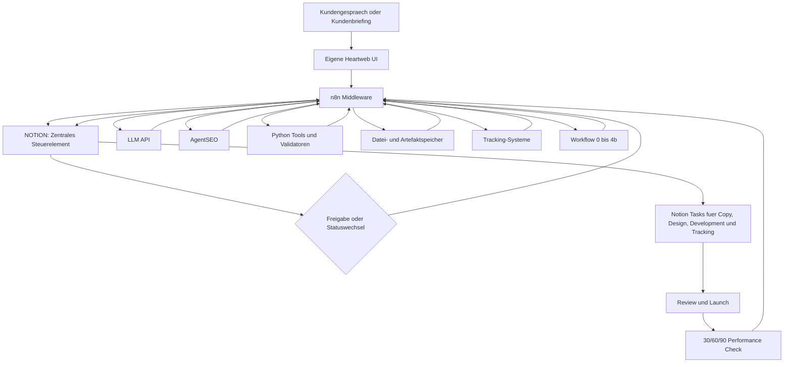

# Heartweb: Migration von Claude Desktop zu Notion, n8n und eigener UI

**Praesentationsgrafik:** `.hermes/plans/heartweb-notion-n8n-ui-migration.png`

**Desktop-Kopien:**

- `C:\Users\offic\Desktop\Heartweb\Heartweb-Operations-Platform-Plan.md`
- `C:\Users\offic\Desktop\Heartweb\heartweb-operations-platform-architecture.png`

## 1. Verbindliches Zielbild

Der bestehende Heartweb SEO/GEO-Workflow laeuft heute ueber die lokale Claude Desktop App. Die neun Produktionsschritte, MCP-Aufrufe, Freigaben und Dateien funktionieren als erster Produktionsprototyp, sind aber an eine lokale Desktop-Sitzung und manuelle Bedienung gebunden.

Das Ziel ist keine zusaetzliche Plattform neben Claude Desktop. Das Ziel ist die vollstaendige operative Migration weg von Claude Desktop:

- Eine eigene Heartweb-UI dient als einfache Bedienoberflaeche.
- n8n ist die Middleware und fuehrt den automatisierten Workflow aus.
- Notion ist das zentrale Steuerelement fuer Kunden, Assessments, Projekte, Phasen, Freigaben, Briefings, Tasks und Status.
- Die vorhandenen Prompts, Regeln, Solver, Validatoren und AgentSEO-Vertraege werden aus Claude Desktop herausgeloest und als automatisierbare Workflow-Schritte hinter n8n betrieben.
- Claude Desktop wird nach erfolgreicher Migration nicht mehr als Produktionsoberflaeche oder Laufzeit benoetigt.
- OpenCode OMO wird ausschliesslich von Raphael und Hermes als Entwicklungswerkzeug genutzt, um die UI und die technische Integration zu bauen. OpenCode ist kein Bestandteil des Heartweb-Produktionssystems.

## 2. Korrekte Rollen der Systeme

### 2.1 Notion: Zentrales Steuerelement

Notion ist die operative Zentrale des Systems.

Notion enthaelt und steuert:

- Kunden
- Ansprechpartner
- Kundengespraeche und Quellen
- Kundenbriefings
- Assessments
- Projekte
- Workflow-Phasen
- Human Gates und Freigaben
- Content-Plaene
- Briefings
- Aufgaben
- Verantwortliche
- Reviews
- Blocker
- Tracking-Aufgaben
- Performance-Checks
- Fehlerstatus

Ein Statuswechsel in Notion kann einen n8n-Workflow starten. n8n schreibt Ergebnisse und Fehler wieder nach Notion zurueck. Die eigene UI zeigt denselben Notion-gesteuerten Prozess in einer klareren und speziell fuer Heartweb gebauten Oberflaeche.

Notion ist damit nicht nur eine Projektion oder ein nachgelagertes Task-Tool. Es ist das zentrale operative Steuerelement.

### 2.2 Eigene UI: Bedienoberflaeche

Die UI ersetzt die manuelle Bedienung in Claude Desktop.

Die UI ermoeglicht:

- Kunden anlegen
- Gespraeche und Briefings hochladen
- Assessment starten
- fehlende Angaben sehen
- Ergebnisse pruefen
- Human Gates freigeben oder ablehnen
- den SEO/GEO-Workflow starten
- den aktuellen Schritt und Fortschritt sehen
- Fehler und notwendige Korrekturen sehen
- Briefings und Outputs oeffnen
- Notion-Aufgaben und Verantwortliche sehen
- Performance-Checks starten oder freigeben

Die UI baut keine zweite Parallelwelt zu Notion. Sie liest und schreibt den zentralen Notion-Zustand ueber die n8n-Middleware und gegebenenfalls eine sehr schmale Backend-Schnittstelle.

### 2.3 n8n: Middleware und automatisierter Loop

n8n ersetzt die manuelle Verkettung der bisherigen Claude-Desktop-Schritte.

n8n uebernimmt:

- Trigger aus UI und Notion
- Laden der benoetigten Kundendaten
- Validierung der Pflichtfelder
- Ausfuehrung der Workflow-Schritte
- Aufruf von LLM, AgentSEO und deterministischen Tools
- Warten auf asynchrone AgentSEO-Jobs
- Schreiben der Outputs
- Aktualisierung des Notion-Status
- Erzeugung und Zuweisung von Notion-Aufgaben
- Human-Gate-Pausen
- Fehlerbehandlung
- Wiederaufnahme nach Freigabe
- 30/60/90-Tage-Performance-Loops

n8n ist die technische Ausfuehrungs- und Integrationsschicht. Die fachliche Steuerung bleibt in den versionierten Heartweb-Regeln und im Notion-Prozessmodell.

### 2.4 SEO/GEO-Workflow: Fachlogik

Der bestehende Ablauf bleibt erhalten:

`0 -> 1 -> 1b -> 1c -> 2 -> 3 -> 3b -> 4a -> 4b`

Er wird nicht neu erfunden. Er wird aus Claude Desktop herausgeloest und automatisierbar gemacht.

Jeder Schritt erhaelt:

- strukturierte Eingabe
- versionierten Prompt
- fest definierte Tools
- erwartetes Output-Schema
- Notion-Status
- Human Gate, falls erforderlich
- Fehlercode
- Retry-Regel
- eindeutige Run-ID

### 2.5 OpenCode OMO: Nur Entwicklungswerkzeug

OpenCode OMO wird nur von Raphael und Hermes verwendet, um:

- die UI zu entwickeln
- n8n-Workflow-Dateien zu bauen und zu pruefen
- Integrationscode zu erstellen
- Tests auszufuehren
- Reviews und Refactorings vorzunehmen

OpenCode OMO:

- arbeitet nicht im spaeteren Kundenprozess
- verarbeitet keine Produktionslaeufe
- steuert Notion nicht
- verteilt keine Heartweb-Tasks
- ist nicht in der Runtime-Architektur
- erscheint nicht als Komponente in der Benutzeroberflaeche

## 3. Zielarchitektur

### Kernloop

1. Die UI sendet einen Start- oder Freigabebefehl an n8n.
2. n8n liest den zentralen Projektzustand aus Notion.
3. n8n prueft Pflichtfelder und Gate-Status.
4. n8n fuehrt den naechsten Workflow-Schritt aus.
5. n8n schreibt Output, Status, Fehler und Links nach Notion.
6. Falls ein Human Gate erforderlich ist, pausiert der Lauf.
7. Jesse oder Raphael gibt in Notion oder der UI frei.
8. n8n setzt den Lauf fort.
9. Nach Schritt 4a oder 4b erzeugt n8n die passenden Notion-Aufgaben.
10. Performance-Daten starten spaeter den 30/60/90-Tage-Loop.

## 4. Was aus Claude Desktop migriert werden muss

### 4.1 Prompts

Die neun XML-Prompts werden zu versionierten Workflow-Ressourcen. n8n laedt je Schritt genau die freigegebene Version.

### 4.2 MCP- und API-Aufrufe

Die aktuelle Claude-Desktop-Konfiguration wird durch serverseitige Aufrufe ersetzt:

- AgentSEO direkt oder ueber einen stabilen Adapter
- LLM ueber eine API, nicht ueber eine lokale Claude-Desktop-Sitzung
- Filesystem ueber einen kontrollierten Artefaktspeicher
- Notion ueber die Notion API
- GitHub nur fuer Framework-Versionen und Entwicklungsprozesse, nicht fuer Tagessteuerung

### 4.3 Lokale Python-Tools

Folgende Tools werden containerisiert oder ueber einen kleinen Tool-Runner aufrufbar gemacht:

- `capacity_matrix_solver.py`
- `validate_schema_jsonld.py`
- weitere deterministische Validierer

n8n uebergibt Dateien und Parameter, erhaelt einen strukturierten Exit-Code und schreibt das Ergebnis nach Notion.

### 4.4 Manifest und Artefakte

Das Manifest bleibt das maschinenlesbare Ausfuehrungsdokument eines Kundenprojekts. Notion steuert jedoch den uebergeordneten Prozess.

Notion speichert:

- Projekt-ID
- Manifest-Version
- aktueller Schritt
- Freigaben
- Links zu Artefakten
- Run-Status
- Fehler

Der Artefaktspeicher enthaelt:

- Manifest
- Rohbriefing
- Transkript
- Keyword-Daten
- Plaene
- Content-Briefings
- HTML-Dateien
- Logs

Dadurch bleibt Notion die Steuerzentrale, ohne grosse Dateien oder technische Zwischenprodukte als Notion-Bloecke erzwingen zu muessen.

## 5. Notion-Datenmodell

### 5.1 Datenbank Kunden

Pflichtfelder:

- Kunden-ID
- Kundenname
- Domain
- Ansprechpartner
- Kontaktinformationen
- Branche
- Zielmaerkte
- Sprache
- Status
- Account Owner
- Quelle
- letzter Kontakt

### 5.2 Datenbank Assessments

Pflichtfelder:

- Assessment-ID
- Kunde
- Gespraech oder Briefing
- strategischer Fit
- SEO/GEO-Potenzial
- Zielgruppe
- Angebot
- Wettbewerb
- Tracking Readiness
- Content Readiness
- Access Readiness
- Risiken
- fehlende Informationen
- Empfehlung
- Jesse-Freigabe
- Raphael-Freigabe
- Status

### 5.3 Datenbank Projekte

Pflichtfelder:

- Projekt-ID
- Kunde
- Projektname
- Workflow-Version
- aktueller Schritt
- Run-ID
- Status
- naechstes Gate
- verantwortliche Person
- Startdatum
- letzter Lauf
- Fehlercode
- Manifest-Link
- Output-Ordner oder Artefakt-Link

### 5.4 Datenbank Workflow-Schritte

Eine Zeile pro Projekt und Schritt:

- Projekt
- Schritt
- Status
- Input validiert
- Run angefordert
- Run-ID
- gestartet am
- abgeschlossen am
- Output-Link
- Fehlercode
- Remediation
- Gate erforderlich
- Gate freigegeben durch
- Gate freigegeben am

### 5.5 Datenbank Tasks

- Task-ID
- Projekt
- Workstream
- Titel
- Beschreibung
- Quellartefakt
- Verantwortlicher
- Reviewer
- Status
- Prioritaet
- Faelligkeit
- Acceptance Criteria
- Abhaengigkeit
- Workflow-Schritt
- Sync-Status

### 5.6 Datenbank Access Requests

Die in allen zehn Briefings fehlenden Zugaenge werden strukturiert:

- Kunde
- System
- benoetigte Rolle
- angefordert bei
- Status
- angefordert am
- verifiziert am
- verifiziert durch
- blockiert Workflow-Schritt
- sichere Uebergabemethode

### 5.7 Datenbank Fehler und Blocker

- Fehler-ID
- Projekt
- Run-ID
- Workflow
- Schritt
- Fehlercode
- Fehlermeldung
- Zeitpunkt
- Retry moeglich
- Verantwortlicher
- Remediation
- geloest am

## 6. Kundenbriefing und Assessment vor dem bestehenden Workflow

Der neue Prozess beginnt vor Schritt 0.

### Phase A: Gespraech und Intake

Input:

- Audio
- Transkript
- Kundenformular
- vorhandenes Briefing
- Website
- interne Notizen

n8n verarbeitet den Input und erzeugt einen Assessment-Entwurf in Notion.

### Phase B: Fehlende Informationen

Die Analyse der zehn Briefings zeigt, dass das Format nicht immer vollstaendig ist. Das System erzeugt deshalb keine Schaetzungen, sondern:

- fehlende Pflichtfelder
- Rueckfragen
- benoetigte Zugaenge
- widerspruechliche Angaben
- unbekannte Zielmaerkte

Diese Punkte werden in Notion sichtbar und koennen ueber die UI bearbeitet werden.

### Phase C: Assessment

Das Assessment prueft:

- Kunden- und Geschaeftsmodell
- Angebotsprioritaeten
- Zielgruppen
- Standorte und Zielmaerkte
- Wettbewerber
- Content-Potenzial
- SEO/GEO-Fit
- Tracking-Reife
- operative Kapazitaet
- Risiken
- benoetigte Workstreams

### Phase D: Human Gate

Jesse entscheidet:

- strategischer und kommerzieller Fit
- Prioritaet
- Kundenfreigabe

Raphael entscheidet:

- technische Vollstaendigkeit
- Automatisierbarkeit
- Workflow-Scope
- Daten- und Integrationsbereitschaft

Erst nach beiden erforderlichen Freigaben setzt Notion den Status auf `Bereit fuer Projektinitialisierung`. Dieser Status startet n8n.

## 7. Automatisierter n8n-Hauptworkflow

### WF-00: Intake und Assessment

Trigger:

- Upload oder UI-Aktion

Ablauf:

1. Quelle registrieren
2. Audio transkribieren, falls vorhanden
3. Briefing strukturieren
4. Pflichtfelder pruefen
5. Assessment in Notion anlegen
6. Rueckfragen und Blocker anlegen
7. auf Human Gate warten

### WF-01: Projektinitialisierung

Trigger:

- Notion-Status `Bereit fuer Projektinitialisierung`

Ablauf:

1. Projekt-ID erzeugen
2. Projektordner oder Remote-Artefaktraum anlegen
3. Manifest erzeugen
4. Schema validieren
5. Projekt und Workflow-Schritte in Notion anlegen
6. Schritt 0 als abgeschlossen markieren
7. Schritt 1 vorbereiten

### WF-02: SEO/GEO-Loop

Trigger:

- freigegebener naechster Schritt

Ablauf:

1. Projekt und Schritt aus Notion laden
2. Input-Artefakte laden
3. Prompt-Version laden
4. LLM und benoetigte Tools aufrufen
5. Output validieren
6. Artefakt speichern
7. Notion aktualisieren
8. Human Gate setzen oder naechsten Schritt starten

Der Loop verarbeitet:

`1 -> 1b -> 1c -> 2 -> 3 -> 3b -> 4a -> 4b`

### WF-03: AgentSEO Async Handler

1. Job mit `sync: false` starten
2. Job-ID in Notion und Run-Kontext speichern
3. Status pollen
4. Timeout und Quota-Fehler hart behandeln
5. Zielmarkt verifizieren
6. Ergebnis an Hauptworkflow zurueckgeben

### WF-04: Notion Task Distribution

Trigger:

- freigegebener Plan oder freigegebenes Briefing

Ablauf:

1. Deliverables auslesen
2. Tasks nach Workstream erzeugen
3. Owner und Reviewer zuordnen
4. Acceptance Criteria uebernehmen
5. Abhaengigkeiten setzen
6. Benachrichtigungen senden
7. Task-Status in Projektansicht spiegeln

### WF-05: Tracking Setup

Trigger:

- Tracking-Task freigegeben

Ablauf:

1. benoetigte Tracking-Systeme bestimmen
2. Access Requests pruefen
3. Installations-Tasks fuer Alexander erzeugen
4. Event- und Conversion-Plan speichern
5. Verifikation dokumentieren
6. Tracking Readiness im Projekt aktualisieren

### WF-06: Performance Loop

Trigger:

- Tag 30, 60 oder 90

Ablauf:

1. GSC-, Analytics-, GBP- und weitere Daten laden
2. Datenvollstaendigkeit pruefen
3. Performance-Check ausfuehren
4. Ergebnis in Notion speichern
5. Anpassungsvorschlag erzeugen
6. Human Gate setzen
7. nach Freigabe neue Tasks erzeugen

### WF-99: Error Handler

Jeder Fehler erzeugt:

- Notion-Fehlereintrag
- Projektstatus `Blockiert`
- exakten Fehlercode
- betroffenen Schritt
- Remediation
- Verantwortlichen
- kontrollierte Retry-Option

Keine stillen Fallbacks.

## 8. UI-MVP

### 8.1 Dashboard

- aktive Kunden
- aktive Projekte
- aktueller Workflow-Schritt
- wartende Freigaben
- Blocker
- Fehler
- ueberfaellige Tasks

### 8.2 Kundenansicht

- Kundendaten aus Notion
- Gespraeche und Briefings
- Assessment
- offene Fragen
- Access Requests
- Projekte

### 8.3 Assessment-Ansicht

- strukturierte Assessment-Felder
- Quellen
- fehlende Informationen
- Jesse-Freigabe
- Raphael-Freigabe
- Ablehnung mit Grund

### 8.4 Workflow-Ansicht

- Schritte 0 bis 4b
- Status pro Schritt
- aktuelle Aktivitaet
- Outputs
- Fehler
- Human Gate
- Starten, erneut versuchen, freigeben oder stoppen

### 8.5 Task-Ansicht

- Aufgaben aus Notion
- Verantwortliche
- Status
- Abhaengigkeiten
- Quellbriefing
- Review

### 8.6 Error Center

- sichtbare n8n- und Toolfehler
- Remediation
- Retry
- verantwortliche Person

## 9. Analyse der zehn Kundenbriefings fuer den Umbau

Die Briefings bestaetigen, dass der Intake vor Schritt 0 strukturiert werden muss.

Gemeinsame Kernbereiche:

- Kunde
- Geschaeftsziel
- Positionierung
- Zielgruppe
- Tonalitaet
- Wettbewerber
- Content-Schwerpunkt
- fehlende Zugaenge

Abweichungen:

- Epargne Plurielle ist unvollstaendig.
- Holistic Tantra hat keinen separaten Standortblock.
- internationale und mehrsprachige Projekte passen nicht in das aktuelle Single-Country-Modell.
- mehrere Projekte haben Recruiting als parallelen Workstream.
- Shunyata Villas Bali umfasst OTAs, Social Media und Ads.
- MobilePhysiotherapie24 umfasst viele Standorte, Satelliten-Domains und Google-Business-Profile.

Folgerung:

Notion braucht ein gemeinsames Kunden- und Assessment-Schema mit bedingten Feldern. n8n darf erst Schritt 0 starten, wenn alle fuer das konkrete Projekt notwendigen Felder vorhanden und freigegeben sind.

## 10. Migrationsphasen

### Phase 0: Notion-Prozess mit Jesse aufnehmen

Ziel:

- das von Jesse gewollte zentrale Notion-Steuerelement exakt dokumentieren

Ergebnisse:

- vorhandene Notion-Datenbanken
- Properties
- Statuswerte
- Rollen
- Freigaben
- Task-Zuweisung
- aktuelle manuelle Schritte
- gewuenschte Automationen

Kein Build vor dieser Aufnahme.

### Phase 1: Notion Control Model

- Kunden-Datenbank definieren
- Assessment-Datenbank definieren
- Projekt-Datenbank definieren
- Workflow-Schritte definieren
- Tasks definieren
- Access Requests definieren
- Fehler definieren
- Statusmaschine definieren
- Trigger- und Gate-Felder definieren

Abnahme:

Jesse bestaetigt, dass Notion den realen Heartweb-Prozess abbildet.

### Phase 2: Ein vertikaler UI-n8n-Notion-Pilot

Ein minimaler Durchlauf:

1. Kunde in UI auswaehlen
2. Daten aus Notion laden
3. Schritt ueber UI starten
4. n8n ausloesen
5. einen bestehenden Prompt ausfuehren
6. Ergebnis speichern
7. Status nach Notion schreiben
8. Ergebnis in UI anzeigen
9. Human Gate in UI und Notion pruefen

Dieser Pilot beweist die Architektur, bevor alle Schritte migriert werden.

### Phase 3: Vollstaendiger SEO/GEO-Loop

- alle Schritte 0 bis 4b migrieren
- AgentSEO Async Handler
- Python Tool Runner
- Output-Validierung
- Gate-Logik
- Error Handler
- Wiederaufnahme

### Phase 4: Intake und Assessment vor Schritt 0

- Audio und Briefing Upload
- Transkription
- strukturierte Extraktion
- fehlende Felder
- Assessment
- Jesse- und Raphael-Gate

### Phase 5: Notion Task Distribution

- Content-Plaene zu Tasks
- Briefings zu Copywriting-Aufgaben
- HTML zu Development-Aufgaben
- Tracking-Aufgaben fuer Alexander
- Reviewer und Acceptance Criteria

### Phase 6: Tracking und Performance

- Tracking Readiness
- Event Plan
- GSC, Analytics und GBP
- gegebenenfalls PostHog
- 30/60/90-Tage-Loop

### Phase 7: Abschaltung der Claude-Desktop-Produktion

Claude Desktop wird erst aus dem Produktionsprozess entfernt, wenn:

- alle neun Schritte ueber n8n laufen
- Human Gates funktionieren
- Notion alle Status korrekt steuert
- UI Start, Fortschritt, Fehler und Freigaben zeigt
- Artefakte vollstaendig gespeichert werden
- ein echter Kundenpilot bestanden ist
- Rollback getestet ist

Danach bleibt Claude Desktop hoechstens ein separates Analysewerkzeug, aber keine Heartweb-Produktionsabhaengigkeit.

## 11. Technische Entscheidungen, die noch offen sind

Diese Punkte muessen mit Jesse, Max und Alexander geklaert werden:

1. Welche Notion-Datenbanken existieren bereits?
2. Welche Properties und Statuswerte sind verbindlich?
3. Welche Notion-Aktion startet n8n?
4. Soll die UI ausschliesslich ueber n8n kommunizieren oder fuer reine Lesezugriffe direkt ueber einen Backend-Adapter?
5. Welcher LLM-API-Provider ersetzt Claude Desktop in der Laufzeit?
6. Wo laufen n8n und die Tool-Runner?
7. Wo werden grosse Artefakte gespeichert?
8. Welche Authentifizierung braucht die UI?
9. Wie erfolgt die Notion-Benutzerzuordnung zu den Teammitgliedern?
10. Meinte Jesse Tally und PostHog?
11. Welche Tracking-Systeme sind verbindlich?
12. Welcher Kunde ist der erste Pilot?

## 12. Fragen fuer den Call mit Jesse

1. Zeig uns bitte das aktuelle Notion-System und die zentralen Datenbanken.
2. Welche Statusaenderungen sollen einen automatischen Lauf starten?
3. Welche Freigaben muessen bei dir bleiben?
4. Welche Informationen kommen aus dem ersten Kundengespraech?
5. Wie entsteht heute das Assessment?
6. Wie werden Aufgaben heute Regina, Katja, Alexander, Thure, Rahul und Wayan zugewiesen?
7. Welche Teile sollen komplett automatisch laufen?
8. Wo soll der Prozess bewusst auf eine menschliche Entscheidung warten?
9. Welche Ansicht soll die eigene UI besser machen als Notion allein?
10. Welcher reale Kunde eignet sich fuer den ersten End-to-End-Test?

## 13. Fragen fuer Max

1. Welche n8n-Infrastruktur existiert bereits?
2. Gibt es bereits Notion-Trigger oder Workflow-Templates?
3. Wie werden n8n-Workflows versioniert und gesichert?
4. Wer betreibt und wartet n8n?
5. Wie werden Credentials gespeichert?
6. Welche Teile baut Max und welche baut Raphael?
7. Wie werden Fehler, Retries und Duplikate behandelt?
8. Welche Schnittstelle braucht Max von der UI?

## 14. Fragen fuer Alexander

1. Welches Tracking-System ist aktuell Standard?
2. Wird PostHog verwendet?
3. Welche Events und Conversions braucht Heartweb?
4. Wie werden Leads und Umsatz dem SEO-Projekt zugeordnet?
5. Wie wird Consent umgesetzt?
6. Welche Daten duerfen nicht erfasst werden?
7. Wie wird eine Installation verifiziert?
8. Welche Tracking-Aufgaben sollen automatisch in Notion entstehen?

## 15. Raphaels Rolle

Raphael verantwortet:

- die Migration des bestehenden Claude-Desktop-Workflows
- die Zielarchitektur von UI, n8n und Notion
- die Daten- und Workflow-Vertraege
- die Ueberfuehrung der Prompts in automatisierbare Schritte
- Fail-Fast-Regeln
- Human Gates
- Tool- und API-Integration
- technische QA
- die gemeinsame Entwicklungsarbeit mit Hermes ueber OpenCode OMO

Passende Rollenbezeichnung:

**Technical Operations & AI Integration Architect**

oder fuer dieses Vorhaben:

**Heartweb Workflow Automation Architect**

Jesse bleibt fachlicher und kommerzieller Sponsor. Notion bleibt sein und des Teams zentrales Steuerelement.

## 16. Testplan

### Notion Tests

- jeder Status hat eine eindeutige Bedeutung
- ungueltige Statusuebergaenge werden blockiert
- jede UI-Aktion erscheint korrekt in Notion
- jede n8n-Aktion schreibt Status und Run-ID zurueck
- keine doppelten Tasks
- Rate Limits werden kontrolliert behandelt

### n8n Tests

- jeder Workflow ist idempotent
- jeder Schritt hat Timeout und Fehlercode
- asynchrone AgentSEO-Jobs werden korrekt fortgesetzt
- ein Human Gate pausiert den Loop
- ein Retry setzt denselben Run fort
- Fehler erzeugen sichtbare Notion-Blocker

### UI Tests

- Kunde anlegen oder auswaehlen
- Assessment sehen
- Workflow starten
- Gate freigeben
- Fehler sehen
- Output oeffnen
- Notion-Task sehen

### Migrationsabnahme

Die Migration ist erst abgeschlossen, wenn ein realer Kundenfall ohne Claude Desktop vom Intake bis zu Notion-Tasks durchlaeuft.

## 17. Rollback

Waehren der Migration bleibt der aktuelle Claude-Desktop-Ablauf als Referenz verfuegbar.

- Jeder migrierte Schritt kann einzeln aktiviert werden.
- Nicht migrierte Schritte laufen weiterhin im bisherigen Prozess.
- Notion-Status zeigt, ob ein Schritt manuell oder automatisiert verarbeitet wurde.
- n8n-Schreibaktionen verwenden eindeutige Run- und Task-IDs.
- Ein fehlgeschlagener Pilot veraendert nicht das bestehende Framework.
- Claude Desktop wird erst nach bestandenem End-to-End-Pilot aus der Produktion entfernt.

## 18. Verbindliche Kurzfassung

Das Zielsystem ist:

**Eigene UI -> n8n Middleware -> Notion als zentrales Steuerelement -> automatisierter SEO/GEO-Loop -> Notion Task-Verteilung und Performance-Steuerung**

OpenCode OMO dient ausschliesslich Raphael und Hermes zum Bau der UI und Integration.

Claude Desktop wird als Produktionslaufzeit ersetzt.

Es wird keine eigenmaechtige alternative Source of Truth ueber Notion gestellt.
